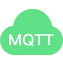

<p align="center">
  
</p>

# Teem MQTT Broker

<p align="center">
  <em>企业级 MQTT 消息中间件 —— 轻量、可嵌入、开箱即用</em>
</p>

<p align="center">
  <a href="#"></a>
  <a href="#"></a>
  <a href="#"></a>
  <a href="#"></a>
  <a href="#"></a>
  <a href="#"></a>
</p>

<p align="center">
  基于 <b>Spring Boot 4.0.6</b> + <b>Moquette</b> 的嵌入式 MQTT Broker，<br/>
  内置 Web 管理控制台，提供实时监控、消息持久化、桥接转发和在线升级等企业级功能。
</p>

> 本项目由 **Xiaomi MiMo v2.5 Pro** 大模型辅助构建。

---

## 目录

- [架构概览](#架构概览)
- [功能特性](#功能特性)
- [技术栈](#技术栈)
- [快速开始](#快速开始)
  - [本地运行](#本地运行)
  - [Docker 部署](#docker-部署)
- [项目结构](#项目结构)
- [配置说明](#配置说明)
- [API 文档](#api-接口)
- [在线升级](#在线升级)
- [常见问题](#常见问题)
- [贡献指南](#贡献指南)
- [许可证](#许可证)

---

## 架构概览

```
                  ┌──────────────────────────────────┐
                  │        Web 管理控制台 (8080)       │
                  │  ┌─────┐ ┌──────┐ ┌──────────┐  │
                  │  │Dash.│ │Monitor│ │MqttTool │  │
                  │  └─────┘ └──────┘ └──────────┘  │
                  │       Vue 3 + Element Plus       │
                  └──────────────┬───────────────────┘
                                 │ REST API / WS
                  ┌──────────────▼───────────────────┐
                  │      Spring Boot Admin 应用       │
                  │  ┌──────┐ ┌────────┐ ┌────────┐ │
                  │  │JWT   │ │WebSocket│ │Logging │ │
                  │  │Auth  │ │Monitor │ │(SSE)   │ │
                  │  └──────┘ └────────┘ └────────┘ │
                  │  ┌──────┐ ┌────────┐ ┌────────┐ │
                  │  │Bridge│ │Persistence│ │Upgrade│ │
                  │  └──────┘ └────────┘ └────────┘ │
                  └──────────────┬───────────────────┘
                                 │
                  ┌──────────────▼───────────────────┐
                  │     Moquette MQTT Broker 引擎     │
                  │  TCP :1883    WebSocket :8083     │
                  │  MQTT 3.1 / 3.1.1 / 5.0          │
                  └──────────────────────────────────┘
```

## 功能特性

### 🔌 MQTT Broker

| 特性 | 说明 |
|------|------|
| 协议支持 | MQTT 3.1 / 3.1.1 / 5.0 全版本兼容 |
| 接入方式 | TCP (`1883`) + WebSocket (`8083`) 双通道 |
| 认证机制 | 用户名密码认证，支持匿名访问开关 |
| ClientID 策略 | 拒绝新连接 / 断开旧连接 两种模式可选 |
| 消息持久化 | H2 嵌入式数据库，AES 文件级加密存储 |
| 消息桥接 | 内置 Bridge 引擎，支持多 Broker 消息转发与路由规则 |

### 📊 Web 管理控制台

- **仪表盘** — JVM 内存/线程/GC、CPU、磁盘等系统指标实时总览
- **MQTT 监控** — WebSocket 实时推送连接数、消息速率、订阅统计、在线客户端
- **客户端管理** — 在线客户端详情查看、强制断开、ACL 订阅规则管理
- **消息记录** — 按 Topic/客户端/时间范围检索历史消息，支持趋势统计图
- **MQTT 调试工具** — 浏览器内嵌 MQTT 客户端，支持订阅/发布/QoS/Retain
- **日志管理** — 按级别搜索、SSE 实时日志流（终端风格，按级别着色高亮）
- **延迟消息** — 定时投递，支持创建、取消、查询和统计
- **系统监控** — Spring Actuator 深度集成
- **在线升级** — 上传 RSA 签名升级包，自动校验并热重启

### 🛡️ 安全

- JWT 双通道认证（Web API + WebSocket）
- 升级包 RSA-2048 签名校验
- H2 数据库 AES 文件级透明加密
- 全局入参校验 @Valid + 统一异常处理
- 密码 BCrypt 哈希存储

## 技术栈

| 层级 | 技术 | 版本 |
|------|------|------|
| 后端框架 | Spring Boot | 4.0.6 |
| MQTT 引擎 | Moquette | 0.18.0 |
| 数据库 | H2 (嵌入式 AES 加密) | — |
| ORM | Spring Data JPA / Hibernate | — |
| 认证授权 | JWT (jjwt) | 0.12.6 |
| API 文档 | Knife4j (OpenAPI 3) | 4.5.0 |
| 前端框架 | Vue 3.5 + Vue Router 4 + Pinia 2 | — |
| UI 组件库 | Element Plus | 2.11 |
| 国际化 | vue-i18n | 中 / 英文 |
| 构建工具 | Maven + Vite | — |
| 容器化 | Docker / Docker Compose | — |

## 快速开始

### 环境要求

- **JDK 21+** (Spring Boot 4.0.6 要求)
- **Maven 3.9+**
- **Node.js 20+** (构建前端时使用，`frontend-maven-plugin` 会自动下载)

### 本地运行

```bash
# 1. 完整构建（含前端）
mvn clean install

# 2. 启动服务
java -jar admin/target/admin-1.0.0.jar
```

启动后访问服务：

| 服务 | 地址 | 说明 |
|------|------|------|
| Web 管理控制台 | http://localhost:8080 | 管理界面 |
| MQTT TCP | `localhost:1883` | 设备连接 |
| MQTT WebSocket | `ws://localhost:8083/mqtt` | 浏览器 MQTT |
| API 文档 | http://localhost:8080/doc.html | Swagger UI |

> 默认登录凭据：`admin` / `admin2026`（首次部署请立即修改）

### Docker 部署

```bash
# 使用 Docker Compose 一键启动
docker compose up -d

# 查看运行状态
docker compose ps

# 查看日志
docker compose logs -f
```

Docker Compose 配置文件位于项目根目录 [`docker-compose.yml`](docker-compose.yml)，可通过环境变量自定义配置：

```bash
JWT_SECRET=your-secret-key \
MQTT_BROKER_PASSWORD=your-password \
docker compose up -d
```

#### 多阶段构建

项目提供 [`Dockerfile`](Dockerfile) 多阶段构建方案，Maven 构建在前端编译在后，最终 JRE 运行时镜像仅约 200MB。

```bash
# 手动构建 Docker 镜像
docker build -t teem-mqtt-broker .

# 运行
docker run -d -p 8080:8080 -p 1883:1883 -p 8083:8083 \
  -e JWT_SECRET=your-secret \
  teem-mqtt-broker
```

## 项目结构

```
mqtt-broker/
├── mqtt-broker/                      # MQTT Broker 核心模块
│   ├── src/main/java/com/jjc/mqtt/
│   │   ├── MoquetteAutoConfiguration.java    # Spring Boot 自动配置
│   │   ├── MoquetteProperties.java           # Broker 配置属性
│   │   ├── MqttPersistenceProperties.java    # 持久化配置属性
│   │   ├── DefaultMoquetteAuthenticator.java # 认证实现
│   │   ├── ConnectedClients.java             # 在线客户端管理
│   │   ├── handler/                          # 拦截处理器（监控、持久化、桥接）
│   │   ├── monitor/                          # 监控服务与数据模型
│   │   ├── bridge/                           # 桥接引擎与路由
│   │   └── event/                            # MQTT 消息事件
│   └── src/test/java/                        # 单元测试
│
├── admin/                            # Spring Boot 主应用
│   ├── src/main/java/com/jjc/mqtt/admin/
│   │   ├── controller/                       # REST API
│   │   ├── persistence/                      # 消息持久化（JPA + H2）
│   │   ├── security/                         # JWT 认证与鉴权
│   │   ├── websocket/                        # WebSocket 实时推送
│   │   ├── logging/                          # 日志管理与 SSE 流
│   │   ├── bridge/                           # 桥接管理
│   │   ├── delayed/                          # 延迟消息投递
│   │   ├── client/                           # 客户端规则管理
│   │   ├── upgrade/                          # 在线升级与签名校验
│   │   ├── actuator/                         # 自定义 Actuator 端点
│   │   └── configuration/                    # 全局配置
│   └── src/main/resources/
│       └── application.yml                   # 主配置文件
│
├── ui-webjar/                        # 前端 Web UI
│   └── src/
│       ├── views/                            # 页面组件
│       ├── api/                              # API 请求封装
│       ├── router/                           # 路由配置
│       ├── stores/                           # Pinia 状态管理
│       ├── i18n/                             # 国际化（中/英文）
│       └── components/                       # 通用组件
│
├── maven-jar-sign-plugin/            # JAR 签名 Maven 插件
├── docs/                             # 项目文档
├── docker-compose.yml                # Docker 编排配置
├── Dockerfile                        # 多阶段构建
└── AGENTS.md                         # AI 辅助开发指引
```

## 配置说明

### MQTT Broker

```yaml
mqtt:
  broker:
    enabled: true
    host: 0.0.0.0                       # 监听地址
    port: 1883                          # TCP 端口
    websocket-port: 8083                # WebSocket 端口
    websocket-path: /mqtt               # WebSocket 路径
    allow-anonymous: false              # 是否允许匿名连接
    username: admin                     # MQTT 用户名
    password: admin2026                 # MQTT 密码
    duplicate-client-id-strategy:       # 重复 ClientID 策略
      REJECT_NEW                        # REJECT_NEW | DISCONNECT_OLD
```

### 消息持久化

```yaml
mqtt:
  broker:
    persistence:
      enabled: true                     # 启用持久化
      queue-size: 10000                 # 异步写入队列大小
      max-rows: 10000                   # 最大存储行数（自动清理最旧记录）
      log-path: ./logs/mqtt             # 日志文件路径
      max-file-size: 100MB              # 单文件大小上限
      max-history: 30                   # 日志保留天数
      total-size-cap: 20GB              # 总大小上限
```

### JWT 认证

```yaml
jwt:
  secret: ${JWT_SECRET:your-32-char-min-secret-key}
  expiration: 86400000                  # Token 有效期（默认 24 小时）
```

> **安全建议**：生产环境务必通过环境变量 `JWT_SECRET` 设置密钥，避免使用默认值。

## API 接口

启动后访问 http://localhost:8080/doc.html 查看完整的 Swagger API 文档（基于 Knife4j + OpenAPI 3）。

| 方法 | 路径 | 说明 |
|------|------|------|
| `POST` | `/v1/login` | 登录认证，返回 JWT Token |
| `GET` | `/v1/health` | 系统健康检查 |
| `GET` | `/v1/monitor/stats` | Broker 运行统计 |
| `GET` | `/v1/monitor/clients` | 在线客户端列表 |
| `POST` | `/v1/monitor/publish` | 通过 Broker 发布消息 |
| `GET` | `/v1/messages` | 分页查询历史消息 |
| `GET` | `/v1/messages/stats` | 消息统计概览 |
| `GET` | `/v1/messages/trend` | 消息趋势数据 |
| `GET` | `/v1/logs/sse` | 实时日志流 (SSE) |
| `WS` | `/ws/monitor` | WebSocket 实时监控 |

## 在线升级

系统支持通过 Web 界面上传签名升级包（`.zip`）进行在线升级，流程如下：

1. 使用 `maven-jar-sign-plugin` 对构建产物进行 RSA 签名
2. 将 JAR 文件和签名文件打包为 `.zip`
3. 登录管理控制台，在「系统升级」页面上传升级包
4. 系统自动校验 RSA 签名 → 备份旧版本 → 热重启应用

> 详细指南请参见 [更新包密匙生成指南](docs/更新包密匙生成指南.md)。

## 贡献指南

欢迎提交 Issue 和 Pull Request。在贡献前请阅读 [CONTRIBUTING.md](CONTRIBUTING.md) 和 [CODE_OF_CONDUCT.md](CODE_OF_CONDUCT.md)。

如发现安全漏洞，请通过 [SECURITY.md](SECURITY.md) 中的方式私下报告。

## 许可证

本项目基于 [Apache License 2.0](LICENSE) 开源。
